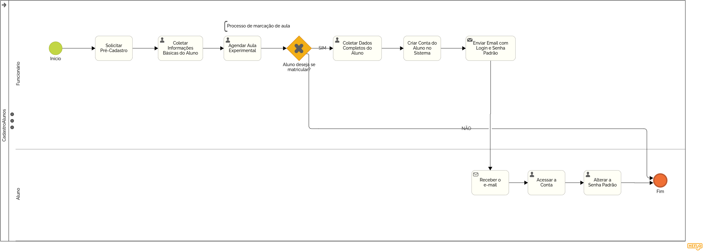

### 3.3.1 Processo 1 – CADASTRO ALUNOS

_Apresentamos aqui o nome e as oportunidades de melhoria para o processo de cadastro de alunos._  
_O cadastro é realizado pela administração da escola, onde um funcionário cria a conta do aluno solicitando seus dados._  
_Ao finalizar o cadastro, o aluno recebe um e-mail com as credenciais de acesso e uma senha padrão, sendo solicitado que a altere ao acessar seu perfil pela primeira vez._

#### Modelo do Processo

#### Detalhamento das atividades

### **Atividade 1 – Pré-Cadastro para Aula Experimental**  

_Cadastro simplificado para alunos que desejam agendar uma aula experimental._

| **Campo**            | **Tipo**         | **Restrições**       | **Valor default** |
|----------------------|------------------|----------------------|-------------------|
| Nome                 | Caixa de Texto   | Obrigatório          |                   |
| Telefone             | Caixa de Texto   | Obrigatório          |                   |
| Idade                | Número           | Obrigatório          |                   |
| E-mail               | Caixa de Texto   | Formato de e-mail    |                   |

| **Comandos**   | **Destino**                       | **Tipo**   |
|----------------|-----------------------------------|------------|
| Agendar Aula   | Confirmação e Agendamento         | default    |
| Cancelar       | Fim do Processo                   | cancel     |

---

### **Atividade 2 – Cadastro de Aluno**  
_Cadastro completo para alunos que realizarem a matrícula._

| **Campo**                           | **Tipo**           | **Restrições**                                      |          **Valor default**           |
|-------------------------------------|--------------------|-----------------------------------------------------|--------------------------------------|
| Nome                                | Caixa de Texto     | Obrigatório                                         |                                      |
| Telefone                            | Caixa de Texto     | Obrigatório                                         |                                      |
| Idade                               | Número             | Obrigatório                                         |                                      |
| Endereço                            | Área de Texto      | Obrigatório                                         |                                      |
| Experiência prévia com dança?       | Seleção única      | Sim/Não                                             |                                      |
| Escola Anterior (se houver)         | Caixa de Texto     | Opcional                                            |                                      |
| Modalidade                          | Seleção múltipla   | Obrigatório                                         |                                      |
| Tempo de experiência por modalidade | Tabela             | Obrigatório se houver experiência                   |                                      |
| Faz parte do corpo de baile?        | Seleção única      | Sim/Não                                             |                                      |
| Tipo de matrícula                   | Seleção única      | Aula livre / Aula fixa                              |                                      |
| E-mail                              | Caixa de Texto     | Formato de e-mail                                   |   Fetch automático do pré cadastro   |
| Senha                               | Caixa de Texto     | Senha padrão enviada por e-mail                     |   Auto-gerado                        |

| **Comandos**       | **Destino**                                  | **Tipo**  |
|--------------------|----------------------------------------------|----------|
| Finalizar Cadastro | Enviar credenciais por e-mail e ativar conta | default  |
| Cancelar           | Fim do Processo                              | cancel   |

---

### **Fluxo de Cadastro**
1. O funcionário realiza o **pré-cadastro** caso o aluno deseje uma aula experimental.
2. Se o aluno decidir se matricular, a administração faz o **cadastro completo**.
3. O sistema gera um e-mail automático contendo:
   - Login do aluno.
   - Senha padrão.
   - Instruções para acessar o perfil e alterar a senha.
4. O aluno acessa o sistema e altera sua senha padrão no primeiro login.

---
