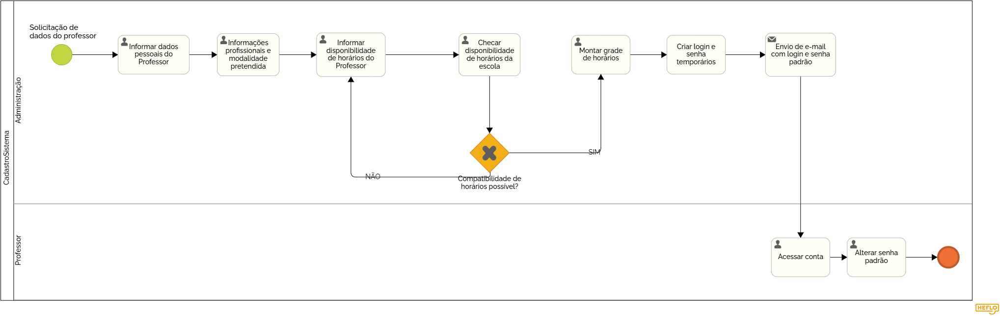

### 3.3.2 Processo 2 – CADASTRO PROFESSORES

Aqui é apresentado o processo de cadastro de professores.  
O cadastro é realizado pela administração da escola, onde são solicitadas as informações pessoais e profissionais do professor.  
Após a verificação dos dados, a compatibilidade de horários é analisada. Caso os horários sejam compatíveis com a disponibilidade da escola, uma grade de horários é montada e um login temporário é gerado.  
No final do processo, o professor recebe um e-mail com as credenciais de acesso e uma senha temporária, sendo solicitado que ele altere a senha ao acessar o sistema pela primeira vez.  

#### Modelo do Processo

#### Detalhamento das atividades

### **Atividade 1 – Cadastro de Professor**  

_Cadastro completo para professores que desejam atuar na escola._

| **Campo**                       | **Tipo**             | **Restrições**                          | **Valor default**               |
|---------------------------------|---------------------|----------------------------------------|--------------------------------|
| Nome                            | Caixa de Texto     | Obrigatório                            |                                |
| Telefone                        | Caixa de Texto     | Obrigatório                            |                                |
| E-mail                          | Caixa de Texto     | Formato de e-mail                      |                                |
| Endereço                        | Área de Texto      | Obrigatório                            |                                |
| Modalidade pretendida           | Seleção única      | Obrigatório                            |                                |
| Informações profissionais       | Área de Texto      | Obrigatório                            |                                |
| Disponibilidade de horários     | Tabela             | Obrigatório                            |                                |
| Experiência                     | Seleção única      | Sim/Não                                |                                |
| Login                           | Caixa de Texto     | Formato de e-mail                      | Auto-gerado                    |
| Senha                           | Caixa de Texto     | Senha padrão enviada por e-mail        | Auto-gerado                    |

| **Comandos**          | **Destino**                                   | **Tipo**   |
|----------------------|---------------------------------------------|-----------|
| Finalizar Cadastro  | Enviar credenciais por e-mail e ativar conta | default   |
| Cancelar            | Fim do Processo                              | cancel    |

---

### **Fluxo de Cadastro**
1. A administração solicita os dados pessoais e profissionais do professor.  
2. A administração informa a disponibilidade de horários do professor.    
   - Se os horários não forem compatíveis, a administração deve revisar e informar nova disponibilidade de horários do professor.  
5. Se os horários forem compatíveis, uma grade de horários é montada.  
6. O sistema gera um login e uma senha temporária para o professor.  
7. Um e-mail automático é enviado contendo:  
   - Login do professor.  
   - Senha temporária.  
   - Instruções para acessar o perfil e alterar a senha.  
8. O professor acessa o sistema e altera a senha temporária no primeiro login.  

---
