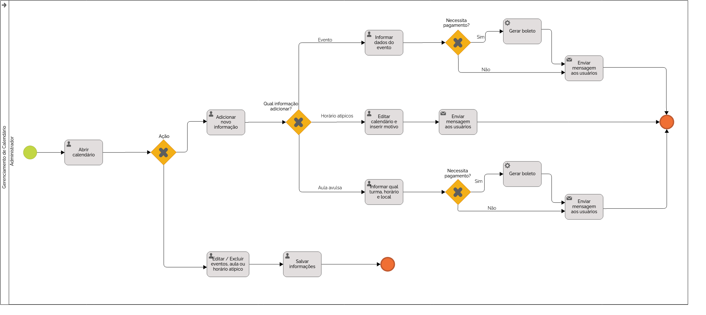

### 3.3.3 Processo 3 – Gerenciamento de calendário

_Este é o processo de gerenciamento de calendário da escola, onde a administração pode adicionar e organizar eventos, além de definir informações de funcionamento da instituição. O administrador tem acesso ao calendário escolar e pode incluir diversos tipos de eventos, configurando detalhes específicos._

#### Detalhamento das atividades

##### **Atividade 1 – Adicionar informações de funcionamento da escola**

1. O administrador acessa o sistema.
2. Ele insere as informações gerais de funcionamento da escola.
3. O sistema valida as informações.
4. O administrador pode confirmar ou cancelar o processo.

##### **Atividade 2 – Adicionar eventos ao calendário**

1. O administrador preenche os detalhes do evento, incluindo nome, data, local e taxa de participação.
2. O sistema verifica se há conflitos de agenda.
3. O administrador pode confirmar ou cancelar o evento.

##### **Atividade 3 – Adicionar informações de ensaios e atividades extras**

1. O administrador define os horários e turmas envolvidas.
2. O sistema valida os horários disponíveis.
3. O administrador pode confirmar ou cancelar o registro.

---

### **Fluxo geral do processo**
1. O administrador define os horários de funcionamento da escola.
2. Caso necessário, ele adiciona eventos ao calendário, incluindo informações como taxa de participação e vencimentos.
3. Para atividades extras, ele pode definir horários e locais específicos para cada turma.
4. O sistema verifica automaticamente conflitos de agendamento antes de confirmar eventos e atividades.
5. O calendário é atualizado e disponibilizado para consulta pelos alunos e demais interessados.

---

### **Resumo das atividades**

#### **Nome da atividade 1 – Adicionar informações de funcionamento da escola**

| **Campo**               | **Tipo**      | **Restrições**                      | **Valor default** |
|-------------------------|--------------|--------------------------------------|-------------------|
| Horário de funcionamento | Área de texto | Obrigatório                         |                   |
| Períodos especiais      | Caixa de texto | Opcional                            |                   |

#### **Nome da atividade 2 – Adicionar eventos ao calendário**

| **Campo**              | **Tipo**          | **Restrições**                        | **Valor default** |
|------------------------|------------------|--------------------------------------|-------------------|
| Nome do evento        | Caixa de texto   | Obrigatório                         |                   |
| Data                  | Data             | Obrigatório                         |                   |
| Horário               | Hora             | Obrigatório                         |                   |
| Local                 | Caixa de texto   | Obrigatório                         |                   |
| Valor da taxa         | Número           | Opcional                            | 0,00              |
| Data de vencimento    | Data             | Opcional se houver taxa             |                   |

#### **Nome da atividade 3 – Adicionar informações de ensaios e atividades extras**

| **Campo**              | **Tipo**          | **Restrições**                        | **Valor default** |
|------------------------|------------------|--------------------------------------|-------------------|
| Turma                 | Seleção única    | Obrigatório                         |                   |
| Data e horário        | Data e Hora      | Deve estar dentro do calendário     |                   |
| Local                 | Caixa de texto   | Obrigatório                         |                   |
