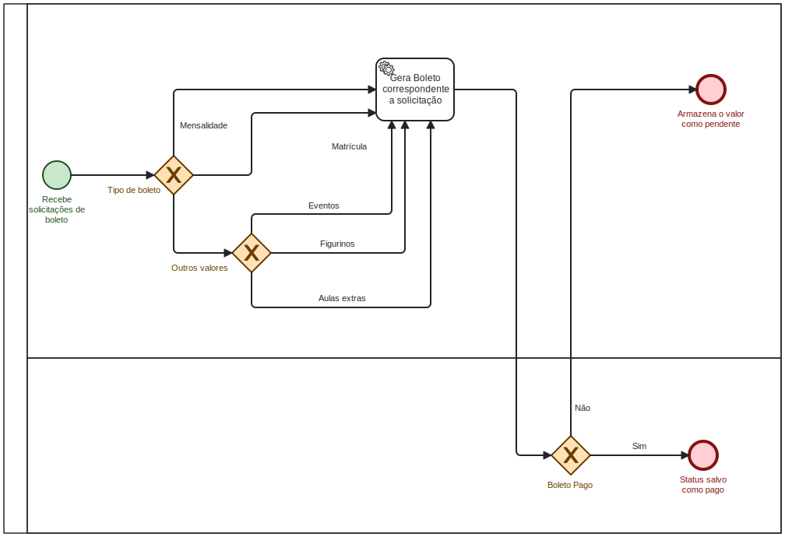

### 3.3.4 Processo 4 – Gestão Financeira

O objetivo da gestão financeira é dar a liberade de vizualição de manipulação do controle financeiro pela parte da administração da escola, tanto em pagamentos, reembolsos, dividendos e mensalidades. Os alunos teram um acesso facilitados aos seus boletos, pagamentos de eventos e figurinos e dividendos extras que possa ocorrer

#### Detalhamento das atividades

*Pagamento de Mensalidade*



```
Gestão se resume em o aluno gerar seus boletos,
o processo gera o boleto para que o aluno pague,
tudo sera salvo e podera ser exibido em uma tela de vizualização da administração
```

_Os tipos de dados a serem utilizados são:_

_* **Status Mensalidade** - Booleano sobre o status da mensalides, se esta paga ou não

_* **Dividendos** - Campo que armazerá pagamentos extras caso alunos precise

_* **Valor Boleto** - Campo com o valor da mensalidade somado aos dividendos

_* **Tipo** - enum que salvara o tipo de boleto (1- Mensalidade, 2- Matricula, 3- Evento, 4- Figurino)

_* **Boleto** - Campo que sera gerado o pdf do boleto

| **Campo**          | **Tipo**         | **Restrições**         | **Valor default** |
| ---                | ---              | ---                    | ---               |
| Status Mensalidade | Boolean          |                        | 0                 |
| Dividendos         | float            | (9,2)                  |                   |
| Valor Boleto       | float            | (9,2)                  |                   |
| Tipo               | int              | enum(1,2,3,4)          |                   |
| Boleto             | image            | pdf                    |                   |


| **Comandos**         |  **Destino**                   | **Tipo**          |
| ---                  | ---                            | ---               |
| Gerar Boleto         | Gera boleto com valor total    | default           |


