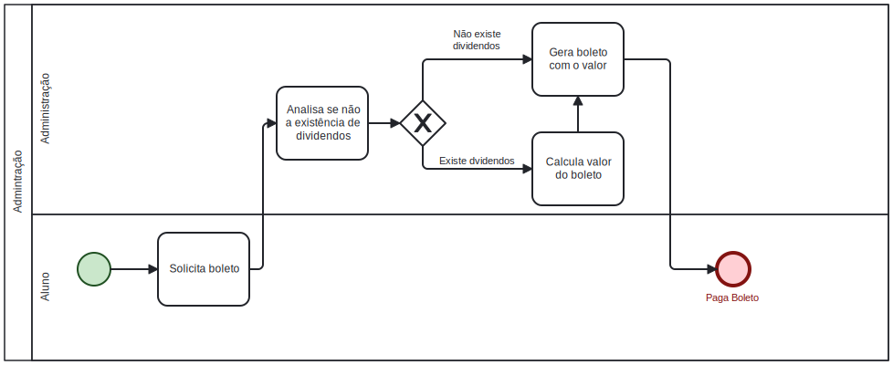
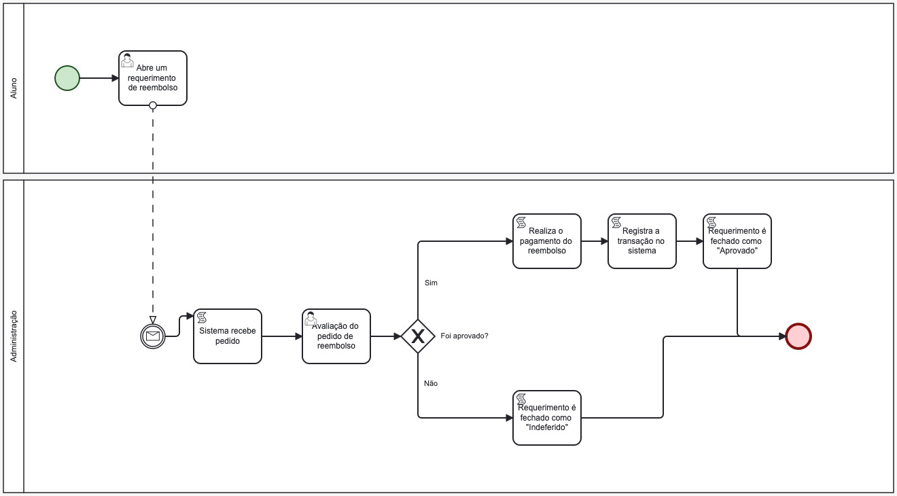
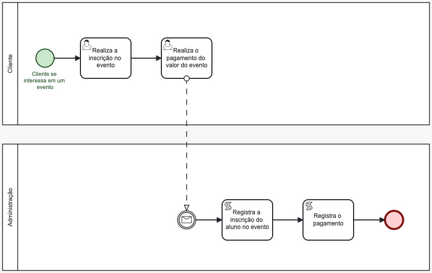
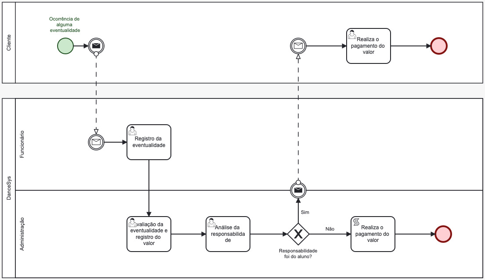

### 3.3.4 Processo 4 – gestão Financeira

O objetivo da gestão financeira é dar a liberade de vizualição de manipulação do controle financeiro pela parte da administração da escola, tanto em pagamentos, reembolsos, dividendos e mensalidades. Os alunos teram um acesso facilitados aos seus boletos, pagamentos de eventos e figurinos e dividendos extras que possa ocorrer

#### Detalhamento das atividades



*Pagamento de Mensalidade*
```
Pagamento de mensalidade se resume em o aluno gerar seus boletos,
o processo calculara seus dividendos (mensalidades atrasadas e valores extras) e somar ao valor total da mensalidade,
tudo sera salvo e podera ser exibido em uma tela de vizualização da administração
```

_Os tipos de dados a serem utilizados são:_

_* **Status Mensalidade** - Booleano sobre o status da mensalides, se esta paga ou não

_* **Dividendos** - Campo que armazerá pagamentos extras caso alunos precise

_* **Valor Boleto** - Campo com o valor da mensalidade somado aos dividendos

_* **Boleto** - Campo que sera gerado o pdf do boleto

| **Campo**          | **Tipo**         | **Restrições**         | **Valor default** |
| ---                | ---              | ---                    | ---               |
| Status Mensalidade | Boolean          |                        | 0                 |
| Dividendos         | float            | (9,2)                  |                   |
| Valor Boleto       | float            | (9,2)                  |                   |
| Boleto             | image            | pdf                    |                   |


| **Comandos**         |  **Destino**                   | **Tipo**          |
| ---                  | ---                            | ---               |
| Gerar Boleto         | Gera boleto com valor total    | default           |


*Pagamento de Reembolso*

```
Pagamento de reembolso ocorre após o aluno realizar o requerimento, este, será enviado para análise da administração. Caso o requerimento seja aprovado, a escola realizará o pagamento da quantia requerida, caso contrário o requerimento é indeferido e o processo é finalizado.
```
| **Campo**          | **Tipo**         | **Restrições**         | **Valor default** |
| ---                | ---              | ---                    | ---               |
| Matricula do Aluno | String           | Tamanho > 0            | ""                |
| Valor Reembolso    | float            | (9,2)                  |                   |
| Observações        | String           |                        | ""                |


*Pagamento de Eventos*

```
Pagamento de eventos ocorre após o aluno ter interesse em algum evento promovido pela escola, o aluno, então, realiza o pagamento do valor de ingresso no evento. A escola, então, após receber o pagamento registra a inscrição do aluno e registra o pagamento no sistema. Assim, concluíndo o processo de pagamento de evento.
```
| **Campo**          | **Tipo**         | **Restrições**         | **Valor default** |
| ---                | ---              | ---                    | ---               |
| IdEvento           | String           | Tamanho > 0            | ""                |
| Matricula do Aluno | String           | Tamanho > 0            | ""                |
| Valor Evento       | float            | (9,2)                  |                   |


*Pagamento de Eventualidades*

```
Pagamento de uma eventualidade ocorre quando algo não usual acontece, como algum acidente que irá necessitar de pagamentos. Um exemplo seria um aluno cair e acidentalmente quebrar um espelho. Após o acontecimento da eventualidade, o funcionário registra a eventualidade no sistema. A administração, então, procede a realizar uma análise do ocorrido, do valor e posteriormente da responsabilidade do acontecimento. Caso seja definido que o cliente é o responsável, ele será notificado para pagar o valor, caso contrário a escola procede a pagar o valor. Assim se finaliza o processo
```
| **Campo**            | **Tipo**          | **Restrições**         | **Valor default** |
| ---                  | ---               | ---                    | ---               |
| Titulo Eventualidade | String            | Tamanho > 0            | ""                |
| Descrição            | String            | Tamanho > 0            | ""                |
| Valor Eventualidade  | float             | (9,2)                  | ""                |
| Matricula do Aluno   | String            | Tamanho > 0            | ""                |


